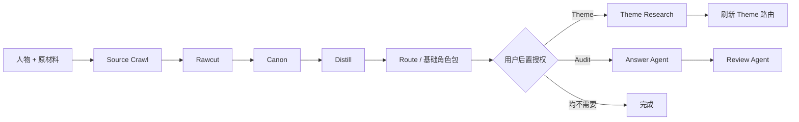

# 角色蒸馏器 | Character Distill Master

> 证据驱动的开源角色蒸馏框架——从小说与游戏剧情中保留原文场景、时期与因果，蒸馏人物的思维、声线、关系与记忆，生成可直接运行的 Agent Skill。

[](./LICENSE)

它不是人设摘要器，也不只是让模型模仿几句口头禅。

角色蒸馏器试着保留更难复制的东西：人物如何理解世界，为什么作出某种选择，面对不同对象时怎样改变距离，以及那些无法被几条标签解释干净的矛盾。

## 三分钟开始

### 1. 获取工作流

```bash
git clone https://github.com/onism11/charactor_distill_master.git
```

将 [`workflows/charactor-distiller_Sv2/`](./workflows/charactor-distiller_Sv2/) 作为 Skill 目录，只从其中的 `SKILL.md` 启动。兼容 Agent Skills 的运行时也可以把该目录复制到自己的 skills 目录。

### 2. 提供人物与原材料

最小输入只有两项：人物是谁，原材料在哪里。可以直接把下面这段交给 Agent：

```text
请使用 persona-skill-distiller 蒸馏以下角色。

人物：{角色名}
原材料：
- {本地文件或目录路径}
- {URL，可选}

目标时期：{可选；不填则在材料扫描后确认}
已知别名 / 排除对象：{可选}
```

原材料可以是小说、剧情文本、台词集、人物故事、语音、设定文件、网页链接或它们的组合。目标时期与别名存在歧义时，工作流会在 Source Crawl 后集中确认，不要求用户预先整理完整规则。

### 3. 决定是否追加 Theme 与 Audit

基础角色包先独立完成。结束时 Agent 应询问：

```text
基础角色包已完成。是否继续：
1. 追加 Theme Research，为哲学、政治、宗教、文学或心理等深层话题建立外部坐标；
2. 运行隔离答题 Audit，由独立 Answer Agent 答题，再由独立 Review Agent 评审。
```

选择 Theme 后只新增 `theme.md` 并刷新其条件路由；选择 Audit 不会改写角色包，只会生成测试与评审结果。两项都可以不选。

## 先看成品

隔壁的 [Sunday Skill · B-before](https://github.com/onism11/sunday/tree/main/%E8%92%B8%E9%A6%8F%E8%A7%92%E8%89%B2/B-before) 是这套蒸馏思路的成品展示。

它不是一份人物百科，而是一个可以直接运行的星期日角色包：`persona + analysis` 构成人物的思考与声线，`action + canon` 管理行动和事实，路由层决定每次回答真正需要读什么。

你还可以查看它的 [固定 10 题答卷](https://github.com/onism11/sunday/blob/main/%E8%92%B8%E9%A6%8F%E8%A7%92%E8%89%B2/check/B-before%2010%20Answers.md) 与 [多版本对照材料](https://github.com/onism11/sunday/tree/main/%E8%92%B8%E9%A6%8F%E8%A7%92%E8%89%B2/check/comparison-materials)：成品质感不只靠一句“很像”来证明。

## 为什么要做成一条流水线

人物材料很容易走向两个极端：压缩过度，最后只剩性格标签；或者把所有原文塞进上下文，让人物被资料噪声淹没。

这里选择第三条路：保留完整证据仓，但只在正确阶段把正确材料交给模型。



- **Source Crawl** 完整归档来源并建立可回查索引。
- **Rawcut** 按连续场景保存人物证据，而不是拆成失去语境的单句。
- **Canon** 整理时期、关系、关键记忆、剧情因果与声线依据，但不抢先替人物下人格结论。
- **Distill** 分开生成 `analysis.md`、`persona.md` 与 `action.md`，让理解、人格和行动纪律各守自己的边界。
- **Route** 让日常对话保持轻盈，只在事实、深层分析、主题研究或记忆真正需要时加载对应层。
- **Theme** 是授权后追加的深层话题坐标，不覆盖人物本身。
- **Audit** 用隔离答题和独立评审检验真实回答，而不只检查 Markdown 是否整齐。

基础包的运行文件为：

```text
SKILL.md
persona.md
analysis.md
action.md
canon.md
memory.md
long_memory.md
```

`source_archive/` 保存证据仓，`check/` 保存检查结果；用户追加 Theme 时，主目录再增加 `theme.md`。

## 精妙的原材料处理

原材料阶段不是简单搜索角色名。

- 保存完整 source archive、manifest 与 source index，任何判断都能回到原文。
- 使用 scene slice 保留事件前因后果、参与者、时期、称谓与关键措辞。
- 区分 confirmed alias、可疑指代与辅助材料，避免把别人的经历或评价混进人物主证据。
- 大材料通过索引与 Evidence Brief 定向回查，不要求后续阶段反复吞下整份 rawcut。
- Canon 位于原文与人格之间：比原文更易调用，又不越权写成二手人格分析。

这让模型既能看到人物的细节，也能看懂人物所处的剧情和制度环境。

## 质量保证来自测试，而不是约束堆叠

这套工作流经历了多轮、多角色、多题组的生成与对照。测试过的变量包括原材料切分、Canon 密度、Analysis 厚度、Action 场景矩阵、路由边界、Checker 分工、证据水合、轻量与严格链路，以及答题提示对最终声线的影响。

许多看起来“更完整”的机制最终没有留下。原因很简单：规则越多不一定越像人物；当纪律开始挤压创造力，就应该删掉纪律，而不是继续重复强调。

当前版本保留的是反复权衡后的核心：

- 人物质量优先于格式完整。
- `persona + analysis` 优先于外围控制层。
- Create 与 Checker 分离，生成者不替自己判卷。
- 答题 Agent 与评审 Agent 隔离，避免参考答案污染。
- Checker 只指出薄弱点和最小返修，不顺手重写整个人物。
- 每次新问题重新路由，避免上一题的分析方式惯性污染下一题。

这里的“质量保证”不是承诺每次都出现神来之笔，而是让证据缺口、时期污染、声线漂移、路由错误和人物变薄能够被发现、定位并返修。

## 自带记忆系统

生成的角色包可以同时拥有两层记忆：

- `memory.md`：当前关系、近期话题与待续事项的主动恢复层。
- `long_memory.md`：默认不读取、只追加不覆盖的长期归档。

记忆不会静默吞下所有聊天。读取由命令或明确的连续性需求触发；`/sum` 先生成草稿，得到确认后才写入；构建 Skill、调试 prompt、`/break` 与 `/out` 等角色外讨论不会污染人物关系记忆。

## 当前公开版本

[S_微调版](./workflows/charactor-distiller_Sv2/) 以 Before-B/S 工作流为底本，只加入经过裁决的轻量改动：单一 Skill 入口、按需 controller 启动提示、可选 Theme 与 Skill Checker、S6 的一条解释权提示，以及仅在原始材料超过 200 KB 时开放的大 rawcut 交接。它不是 rerun/newversion 的复杂编排，也不包含实验产物。

它适合从小说、游戏剧情、台词集、人物故事或混合设定材料中，制作重视人物质感和长期对话能力的角色 Skill。

它尤其适合那些不能被“温柔、理性、强大”几句话概括的人物：有明显时期变化、复杂关系、制度处境、价值冲突，或者需要在日常聊天与深度讨论之间自然切换。

## 运行边界

- 只从根 `SKILL.md` 启动，按阶段读取对应文件，不一次性预载全部 prompt。
- `workflow-prompts/` 是生产控制面；每次只给当前执行角色一份对应启动提示，不复制进最终角色包。
- F/G 只在用户选择答题 Audit 或横向评测时启动。
- 原始材料和生成包放在独立运行目录，避免污染工作流源码。

## 设计来源与边界

`persona.md` 的结构设计参考了 [dot-skill](https://github.com/titanwings/colleague-skill)。角色蒸馏器在此基础上扩展了原材料证据追踪、Analysis、Canon、Theme、运行路由、记忆与隔离测试链路。

本仓库只发布工作流主文件，不包含原始角色材料、私有运行日志、真实用户画像或历史对话记忆。仓库内的 `memory.md` 与 `long_memory.md` 均为空白模板。

S_微调版的准确文件来源与发布边界见 [PROVENANCE.md](./workflows/charactor-distiller_Sv2/PROVENANCE.md)。
