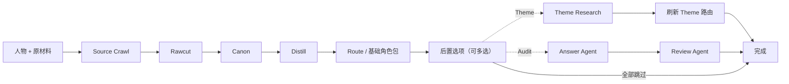

# 角色蒸馏器 | Character Distill Master

> **把整部故事，蒸馏成一个有自己判断的角色。**
>
> 不只复刻口吻：保留小说与游戏原文中的场景、时期、关系与因果，生成有声线、有记忆、可直接运行、也能回到证据的 Agent Skill。

[](./LICENSE)
[](./workflows/charactor-distiller_Sv2/)

[为什么选它](#为什么选它) · [三分钟启动](#三分钟启动) · [先看成品](#先看成品) · [工作流](#从原文到角色) · [当前版本](#当前公开版本)

当用户问出原作从未写过的问题，真正的人物蒸馏才开始。

一个角色不该只会复述设定、模仿口癖或顺从用户给出的前提。他应当能依据自己的经历、关系和价值次序作出判断；换了对象、压力与时期，仍然像同一个人。

角色蒸馏器为这种复杂人物而设计。它把原文证据处理、人物解释、运行路由、受控记忆与隔离测试串成一条可复用流水线，最终交付的不是人物报告，而是一个能继续生活和说话的角色。

## 为什么选它

许多工具擅长把资料整理成角色卡或结构化字段；这个项目选择把力气花在另一件事上：**尽量保住人物在脱离原剧情后仍能独立思考的能力。**

| 常见短路径 | 角色蒸馏器 |
| --- | --- |
| 搜索名字、摘录单句 | 保存完整来源，以连续场景、别名和时期边界组织证据 |
| 用性格标签或维度表概括人物 | 分开蒸馏人物为何如此、如何说话、会怎样行动 |
| 把设定和原文全部塞进一个大提示词 | 以路由按需加载事实、主题、行动和记忆层 |
| 生成者同时负责自检 | Create、Checker、Answer、Review 分工隔离 |
| 检查字段是否齐全 | 用真实问题检查声线、判断、关系距离与事实连续性 |

它不靠“维度更多”取胜，也不要求用大量纪律把模型钉死。核心取舍是：证据足够近，边界足够清楚，限制尽量少，让人物的矛盾、锋芒和解释权有空间留下来。

## 最终得到什么

基础产物是一个可直接运行的七文件角色包：

```text
character-skill/
├── SKILL.md           # 唯一运行入口与按需路由
├── persona.md         # 声线、关系距离、情绪和自我呈现
├── analysis.md        # 动机、价值次序、矛盾与跨场景因果
├── action.md          # 行动边界、压力反应与场景选择
├── canon.md           # 时期、关系、事实、记忆与关键因果
├── memory.md          # 当前关系与近期连续性
├── long_memory.md     # 默认不加载的长期追加式归档
├── source_archive/    # 可回查的原始证据仓
└── check/             # 生成阶段的检查记录
```

如果用户追加 Theme Research，主目录才会增加 `theme.md`。它为哲学、政治、宗教、文学或心理等深层话题提供外部坐标，但不替代角色自己的判断。

这套分层让人物可以在不同问题里调用不同深度：日常聊天不必背着整部原作，涉及事实时再读 Canon，需要深层讨论时才加载 Theme，关系连续性明确需要时才恢复 Memory。

## 三分钟启动

### 1. 获取工作流

```bash
git clone https://github.com/onism11/charactor_distill_master.git
```

将 [`workflows/charactor-distiller_Sv2/`](./workflows/charactor-distiller_Sv2/) 作为 Skill 目录，只从其中的 `SKILL.md` 启动。兼容 Agent Skills 的运行时也可以把该目录复制到自己的 skills 目录。

### 2. 交给 Agent 两样东西

最小输入只有：**人物是谁，原材料在哪里。**

```text
请使用 persona-skill-distiller 蒸馏以下角色。

人物：{角色名}
原材料：
- {本地文件或目录路径}
- {URL，可选}

目标时期：{可选；不填则在材料扫描后确认}
已知别名 / 排除对象：{可选}
```

原材料可以是小说、游戏剧情、台词集、人物故事、语音、设定文件、网页链接或它们的组合。目标时期、别名或排除范围存在歧义时，工作流会在 Source Crawl 后一次性确认，不要求用户先把材料整理成专用格式。

### 3. 基础包完成后再决定是否加深

工作流会先完成可运行的基础角色包，再询问是否继续：

```text
1. 追加 Theme Research；
2. 运行隔离答题 Audit；
3. 两项都做；
4. 到此结束。
```

Theme 只新增研究层并刷新对应路由；Audit 由独立 Answer Agent 答题，再由独立 Review Agent 评审，不改写已经完成的角色包。两项都不是默认成本。

## 先看成品

先别急着读所有架构。可以直接打开 [Sunday Skill · B-before](https://github.com/onism11/sunday/tree/main/%E8%92%B8%E9%A6%8F%E8%A7%92%E8%89%B2/B-before)，看一个复杂游戏人物经过蒸馏后如何实际运行。

这份成品不是星期日的人物百科。`persona + analysis` 支撑他的声线和判断，`action + canon` 约束行动与事实，`SKILL.md` 决定每次回答真正需要加载哪一层。

还可以继续查看：

- [固定 10 题答卷](https://github.com/onism11/sunday/blob/main/%E8%92%B8%E9%A6%8F%E8%A7%92%E8%89%B2/check/B-before%2010%20Answers.md)：观察角色面对原作之外的问题时，是否仍有自己的立场和关系距离。
- [多版本对照材料](https://github.com/onism11/sunday/tree/main/%E8%92%B8%E9%A6%8F%E8%A7%92%E8%89%B2/check/comparison-materials)：比较声线、人物厚度、低压对话和错误风格输入下的稳定性。

特别值得看的不是它能否背出台词，而是它能否识别一个不属于自己的前提或文风，拒绝被用户改造成另一个人，同时仍然回应用户真正想要的东西。

## 从原文到角色

人物材料常走向两个极端：压缩过度，最后只剩性格标签；或者把全部原文塞进上下文，让人物被资料噪声淹没。

这里保留完整证据仓，但只在正确阶段把正确材料交给模型：



| 阶段 | 做什么 | 不越过的边界 |
| --- | --- | --- |
| Source Crawl | 归档来源，建立索引，确认人物、时期和别名范围 | 不提前筛成一份“模型觉得重要”的摘要 |
| Rawcut | 以连续场景保存人物证据和必要上下文 | 不把孤立金句冒充完整人格 |
| Canon | 整理时期、关系、记忆、事实、因果与声线依据 | 不抢先替人物下道德或人格结论 |
| Distill | 分开生成 `analysis`、`persona` 与 `action` | 不用一个万能模板抹平人物矛盾 |
| Route | 生成唯一运行入口并配置条件读取 | 不让每次回答默认加载整个包 |
| Theme | 在用户授权后研究外部思想坐标 | 不用理论覆盖人物原有立场 |
| Audit | 隔离答题、评审并定位问题 | 不让参考答案和评分标准污染答题者 |

## 五个核心能力

### 1. 证据近，而且能回去

- 保存完整 `source_archive`、manifest 与 source index，任何关键判断都能回到原文。
- 使用 scene slice 保留事件前因后果、参与者、时期、称谓与关键措辞。
- 区分 confirmed alias、可疑指代与辅助材料，降低把他人经历混进角色的风险。
- 只有原始材料超过 200 KB 时，才开放大 Rawcut 的索引与 Evidence Brief 交接；普通材料不为复杂机制付费。

### 2. 蒸馏人物，不是压平人物

`analysis.md` 解释人物如何理解世界、为什么形成某种选择；`persona.md` 保留声线、关系距离与自我呈现；`action.md` 处理压力下的行动边界。三者分开，是为了允许人物存在尚未解决的矛盾，而不是急着把失败写成认命、悔罪或一条道德结论。

### 3. 运行时只读真正需要的层

`persona` 是常驻声线地基，`analysis` 在动机、因果、关系逻辑和价值冲突等深层问题中提供判断。事实核对、特殊行动、主题研究和记忆再按问题条件加载。这样既减少上下文负担，也避免角色每次开口都像人物百科、论文或审计报告。

### 4. 生成与判卷彼此隔离

Create 和 Checker 分开；答题 Agent 看不到 benchmark、评分或其他答案；Review Agent 只评审，不替角色重答。Checker 指出证据缺口、时期污染、声线漂移或路由错误，并要求最小返修，而不是趁检查重写整个人物。

### 5. 记忆可控，而不是静默吸收一切

- `memory.md` 保存当前关系、近期话题与待续事项。
- `long_memory.md` 默认不读取，只追加、不覆盖。
- `/sum` 先生成草稿，确认后才写入。
- 构建 Skill、调试 prompt、`/break` 与 `/out` 等角色外讨论不会进入人物关系记忆。

## 这套工作流适合谁

它尤其适合：

- 来自长篇小说、游戏主线、台词集或多来源设定的复杂人物；
- 有明显时期变化、关系差异、制度处境或价值冲突的人物；
- 需要从轻松日常自然切换到事实追问和深层讨论的角色；
- 重视人物质感、长期对话、证据可追溯和版本对照的创作者。

它优先解决单个复杂人物的蒸馏质量，不以 Web UI、关系图谱、一键 Wiki 抓取或酒馆角色卡格式转换为主要卖点。如果你的目标只是快速转换现成角色卡，更短的工具会更直接；如果你希望人物离开原剧情后仍像他自己，这正是本项目要解决的问题。

## 当前公开版本

[S_微调版](./workflows/charactor-distiller_Sv2/) 以 Before-B / S 工作流为底本，只保留经过裁决的轻量增量：

- 唯一根 Skill 入口；五个阶段文件只在需要时读取，不各自注册为 Skill。
- Controller 启动提示按当前执行角色单份加载，不复制进最终人物包。
- Theme 与 F/G 答题 Audit 放在基础包完成之后，由用户选择。
- Skill Checker 按需运行；Distill 只保留一条很薄的人物解释权提示。
- 只有原始材料合计超过 200 KB 时，才允许进入既有的大 Rawcut 交接。

它不是 rerun / newversion 的复杂编排，不包含私有实验产物，也没有为了“更稳”把所有检查和研究默认开启。

## 运行边界

- 只从工作流根 `SKILL.md` 启动，按阶段读取对应文件，不一次性预载全部 prompt。
- `workflow-prompts/` 是生产控制面；每次只向当前执行角色提供一份启动提示。
- F/G 只在用户选择答题 Audit 或横向评测时启动。
- 原始材料和生成包放在独立运行目录，避免污染工作流源码。
- 工作流负责生成角色；最终角色包不会携带 controller prompts 或生产阶段上下文。

## 设计来源、发布边界与许可证

`persona.md` 的结构设计参考了 [dot-skill](https://github.com/titanwings/colleague-skill)。角色蒸馏器在此基础上扩展了原材料证据追踪、Analysis、Canon、Theme、运行路由、记忆与隔离测试链路。

本仓库只发布工作流主体，不包含原始角色材料、私有运行日志、真实用户画像或历史对话记忆。仓库内的 `memory.md` 与 `long_memory.md` 均为空白模板。S_微调版的准确文件来源与发布边界见 [PROVENANCE.md](./workflows/charactor-distiller_Sv2/PROVENANCE.md)。

本项目以 [MIT License](./LICENSE) 开源。
